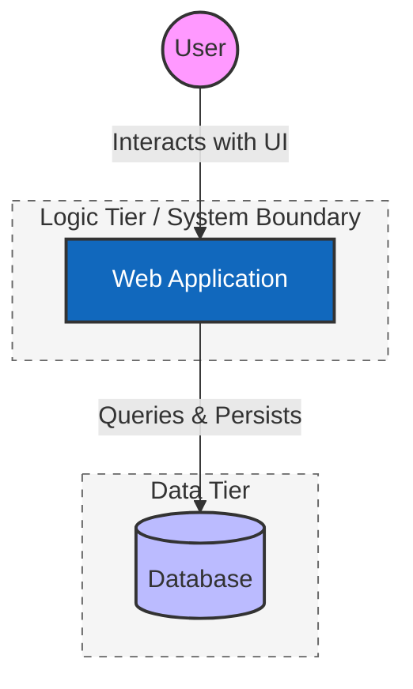

# Level 1: System Context Diagram

## 📌 Overview

This document defines the high-level architecture of the system using the **C4 Model (Level 1)**. At this stage, we focus on the **System Context**, which illustrates how users interact with the system and how the system manages data at a broad scale.

Our system follows a **Three-Tier Architecture** pattern to ensure a clean separation of concerns between the user interface, business logic, and data persistence.

---

## 🗺 Visual Representation

---

# The Three-Tier Breakdown

The Three-Tier architecture is a well-established software application architecture pattern that organizes applications into three logical and physical computing tiers.

## 1. The Presentation Tier (The User)

This is the entry point of the system.

- **Role:** This tier represents the interface (Web/Mobile) that the user interacts with.
- **Responsibility:** It is responsible for displaying data to the user and capturing user inputs. It does not process data directly; instead, it sends requests to the Logic Tier.

## 2. The Logic Tier (Web Application)

This is the "Brain" of the application.

- **Role:** This tier acts as the intermediary between the user interface and the database.
- **Responsibility:** It handles the business logic, calculations, and data processing. It ensures that the user's requests follow the project's rules before any data is written or retrieved. By isolating this tier, we can modify how the app "thinks" without breaking the database or the UI.

## 3. The Data Tier (Database)

This is the Persistence Layer.

- **Role:** This tier consists of the database and servers responsible for data storage and retrieval.
- **Responsibility:** It ensures that information remains available even after a user logs out or the application restarts. Separating the Data Tier allows us to scale storage and manage security backups independently of the application logic.

## 🔄 Interaction Flow

1. **Request:** The User triggers an action (e.g., clicking "Save") in the Presentation Tier.
2. **Process:** The Web Application (Logic Tier) receives the request, validates the user's permissions, and processes the business logic.
3. **Storage:** The Web Application sends the processed data to the Database (Data Tier).
4. **Response:** The Database confirms the save; the Web Application sends a confirmation back to the User.

## 🛠 Legend

| Shape | Name | Description |
|-------|------|-------------|
| Circle | Person | A human user of the system. |
| Rectangle | Software System | The primary application logic and boundary. |
| Cylinder | Database | The persistence layer where data is stored. |
| Solid Line | Sync Interaction | A direct communication path between tiers. |
