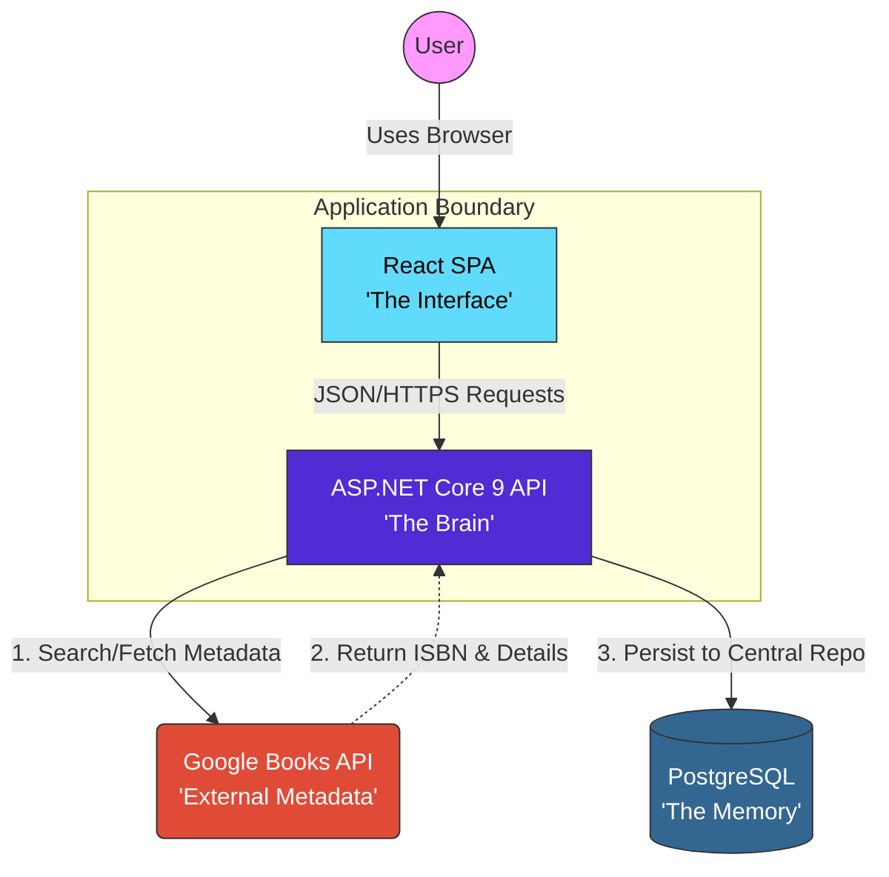

# Level 2: Container Diagram

## 📌 Overview
This diagram "zooms in" on the System Boundary established in Level 1. It identifies the high-level technical containers, their specific technology stacks, and how they communicate to manage the central repository of book data and user interactions.

## 🏗 Container Responsibility Matrix

| Container | Technology | Responsibility |
|-----------|-----------|----------------|
| **Frontend (React)** | React + Vite | Renders the UI, handles routing, and captures user search queries for books. |
| **Backend (API)** | ASP.NET Core 9 | Orchestrates business logic. It acts as the gatekeeper between the Frontend, the Database, and the External Book API. |
| **Database** | PostgreSQL | Our Central Repository. Stores cached book metadata indexed by ISBN, user accounts, and activity logs. |
| **External API** | Google Books API | Provides the verified "Source of Truth" for book details (ISBN, Authors, Cover Art). |

## 🔗 Communication Protocols

* **User ↔ Frontend**: HTTPS (Browser)
* **Frontend ↔ Backend**: RESTful JSON over HTTPS
* **Backend ↔ Database**: SQL / Entity Framework Core
* **Backend ↔ External API**: REST/HTTPS (Server-to-Server)