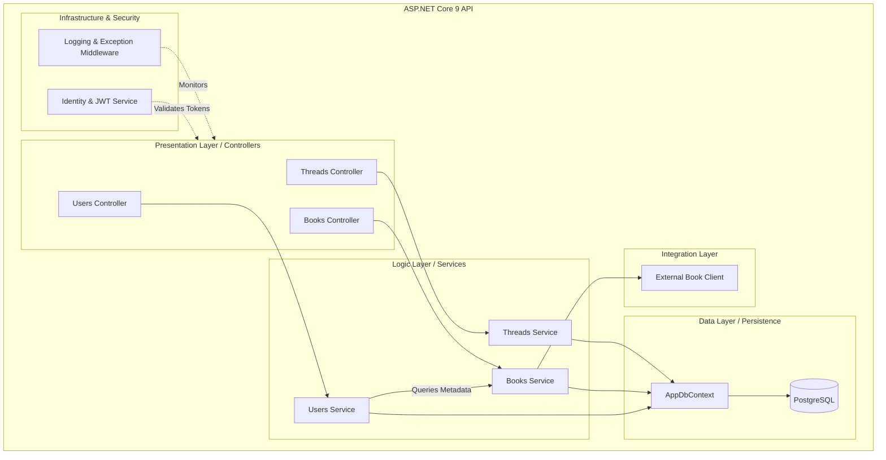

# Level 3: Component Diagram (Full API Interior)

## 📌 Overview
This diagram provides the complete view of the ASP.NET Core 9 API. It shows the "Feature" services (Threads, Books, Users), the "Infrastructure" (Auth, Logging), and the "Data/Integration" layers (Database, Google Books API) working together.

# 🏗 Component Responsibilities (Updated)

| Component | Responsibility |
|-----------|----------------|
| **Identity & JWT Service** | Handles password hashing, user registration, and generating secure tokens for the React/Mobile frontend. |
| **Logging Middleware** | Automatically captures every request/error and logs it for debugging. |
| **Threads Service** | Business logic for social interactions (Posts, Replies, Feeds). |
| **Books Service** | Orchestrates book data—checks the Database first, then calls the External Client. |
| **Users Service** | Manages profiles, follower relationships, and reading statistics. |
| **AppDbContext** | The central gateway for all SQL operations via Entity Framework Core 9. |
| **External Book Client** | Handles the actual HTTPS communication with the Google Books API. |